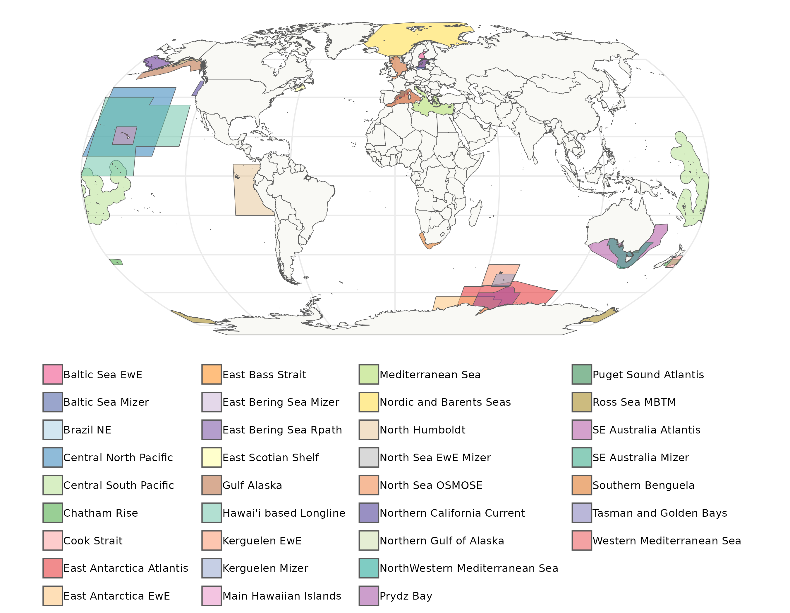

# FishMIP Regional Ecosystem Models
The Fisheries and Marine Ecosystem Model Intercomparison Project ([Fish-MIP](https://fish-mip.github.io/)) aims to improve our understanding of the long-term impacts of climate change on fisheries and marine ecosystems, so we can improve future projections, which in turn can help inform policy.  
  
Our include includes several global and regional ecosystem models. In this repository, we create a single shapefile containing all regional model contributions to Fish-MIP. We can use this file to create [maps](Outputs/FishMIP_regional_models.pdf) and to extract forcing data from Earth System Models (ESMs) for regional ecosystem modelers.  
  
If you are interested in submitting your regional model to the Fish-MIP group, please contact our **Regional Model Coordinators**. You can find their contact details in our [website](https://fish-mip.github.io/).  
  
Due to the large size of files, we are not able to share all individual model boundaries, but we are sharing a compressed (`zip`) folder containing the shapefile with all Fish-MIP regions in the [Outputs folder](Outputs/FishMIP_regional_models.zip). Alternatively, this shapefile is also available from the [FishMIP THREDDS server](http://portal.sf.utas.edu.au/thredds/catalog/gem/fishmip/FishMIP_regions/catalog.html).  
  

## Table of contents
- [Creating regional model workflow figure](00_Regional_model_workflow.md): In this `Rmarkdown` notebook, we use the `DiagrammeR` package to create a workflow diagram for the FishMIP regional models.
- [Merging regional shapefiles into a single file](Scripts/01_Merging_Regional_Shapefiles.md): Describe how we created a single shapefile containing all regional model boundaries.  
- [Mapping regional shapefiles](Scripts/02_Mapping_Regional_Models.md): Creates a simple map with all FishMIP regional models (except Southern Ocean). It also creates a mpa with inset to highlight areas that are difficult to see at the global scale.  
- [Creating two dimensional raster masks](Scripts/03a_Regional_Models_2DMasks.md): This `Rmarkdown` shows how to create a simple raster mask (when boundaries do not overlap) that can be used to extract data from ESM outputs. It uses the original Southern Ocean model boundary containing subregions.     
- [Creating three dimensional raster masks](Scripts/03b_Regional_Models_3DMasks.md): How to create a 3D raster mask (when boundaries do overlap) that can be used to extract data from ESM outputs.  
- [Outputs folder](Outputs/): Contains a copy of the FishMIP regional shapefile in a compressed folder, maps created from this shapefile, and the workflow figure as `svg` and `png` formats.  
  
## Have questions or suggestions?
Feel free to create an [Issue](https://github.com/Fish-MIP/FishMIP_regions/issues) or [email us](mailto:fishmip.coordinators@gmail.com).  
  
If your query is about data extraction for your regional model, please start an issue using the [`Data extraction request` template](https://github.com/Fish-MIP/FishMIP_regions/issues/new?assignees=lidefi87&labels=&projects=&template=data-extraction-request.md&title=Data+extraction+request). Make sure you provide all details requested so we can extract the data correctly.  
