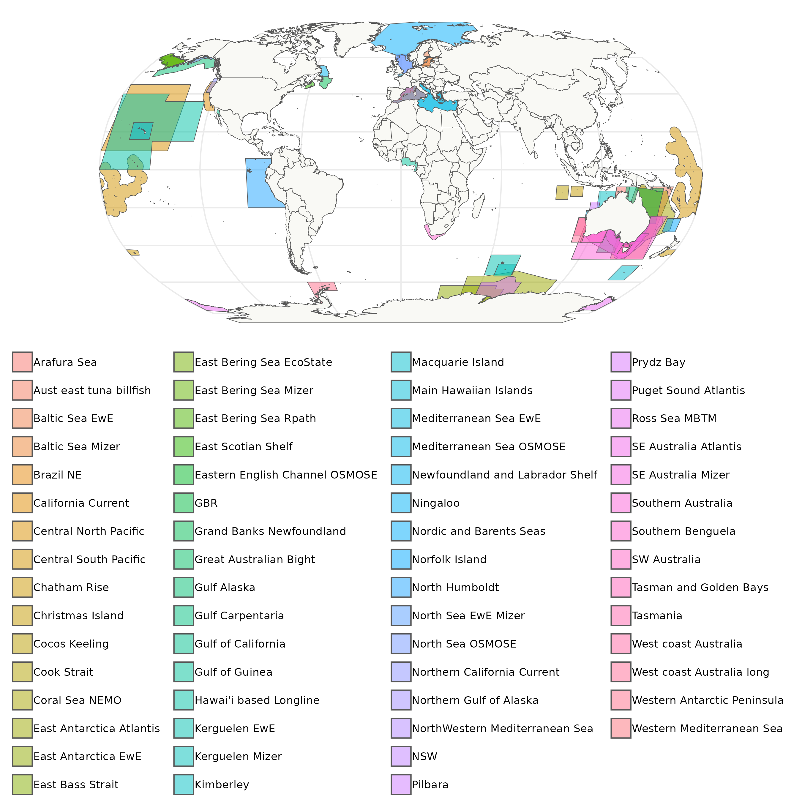

# FishMIP Regional Ecosystem Models
The Fisheries and Marine Ecosystem Model Intercomparison Project ([FishMIP](https://fish-mip.github.io/)) aims to improve our understanding of the long-term impacts of climate change on fisheries and marine ecosystems, to enhance the accuracy of biomass projections under different climate scenarios, which in turn can help inform policy.  
  
The FishMIP model ensemble includes several global and regional ecosystem models. In this repository, we create a single shapefile containing all regional model contributions to FishMIP. We can use this file to create [maps](Outputs/FishMIP_regional_models.pdf) and to extract forcing data from Earth System Models (ESMs) for regional ecosystem modelers.  
  
If you are interested in submitting your regional model to the FishMIP group, please contact our **Regional Model Coordinators**. You can find their contact details in our [website](https://fish-mip.github.io/).  
  
Due to the large size of files, we are not able to share all individual model boundaries, but we are sharing a compressed (`zip`) folder containing the shapefile with all FishMIP regions in the [Outputs folder](Outputs/FishMIP_regional_models.zip). Alternatively, this shapefile is also available from the [FishMIP THREDDS server](http://portal.sf.utas.edu.au/thredds/catalog/gem/fishmip/FishMIP_regions/catalog.html).  
  

## Table of contents
- [Creating regional model workflow figure](scripts/00_Regional_model_workflow.md): In this `Rmarkdown` notebook, we use the `DiagrammeR` package to create a workflow diagram for the FishMIP regional models.
- [Merging regional shapefiles into a single file](scripts/01_Merging_Regional_Shapefiles.md): Describe how we created a single shapefile containing all regional model boundaries.  
- [Mapping regional shapefiles](scripts/02_Mapping_Regional_Models.md): Creates a simple map with all FishMIP regional models (except Southern Ocean). It also creates a mpa with inset to highlight areas that are difficult to see at the global scale.  
- [Creating two dimensional raster masks](scripts/03a_Regional_Models_2DMasks.md): This `Rmarkdown` shows how to create a simple raster mask (when boundaries do not overlap) that can be used to extract data from ESM outputs. It uses the original Southern Ocean model boundary containing subregions.     
- [Creating three dimensional raster masks](scripts/03b_Regional_Models_3DMasks.md): How to create a 3D raster mask (when boundaries do overlap) that can be used to extract data from ESM outputs.  
- [Extracting forcing data for ecosystem models](scripts/04_regional_data_extractions.ipynb): We extract data from GFDL-MOM6-COBALT2 using the regional gridded mask and shapefile. Data extracted is saved in cloud optimised formats: `zarr` for gridded data (where a `depth` dimension is present) and `parquet` for tabular data.  
- [Outputs folder](outputs/): Contains a copy of the FishMIP regional shapefile in a compressed folder, maps created from this shapefile, and the workflow figure as `svg` and `png` formats.  

## Contributors
- [Denisse Fierro Arcos](https://github.com/lidefi87)  
- [Kelly Cisneros Ortega](https://github.com/kortegac)  
- [Tormey Reimer](https://github.com/stormeyseas)  

If you would like to contribute a Python or R script, you can send a Pull Request.  

## Have questions or suggestions?
If you have an idea about a new script or spotted an error, feel free to create an [Issue](https://github.com/Fish-MIP/FishMIP_regions/issues) or [email us](mailto:fishmip.coordinators@gmail.com).  
  
If your query is about data extraction for your regional model, please start an issue using the [`Data extraction request` template](https://github.com/Fish-MIP/FishMIP_regions/issues/new?assignees=lidefi87&labels=&projects=&template=data-extraction-request.md&title=Data+extraction+request). Make sure you provide all details requested so we can extract the data you need correctly.  
