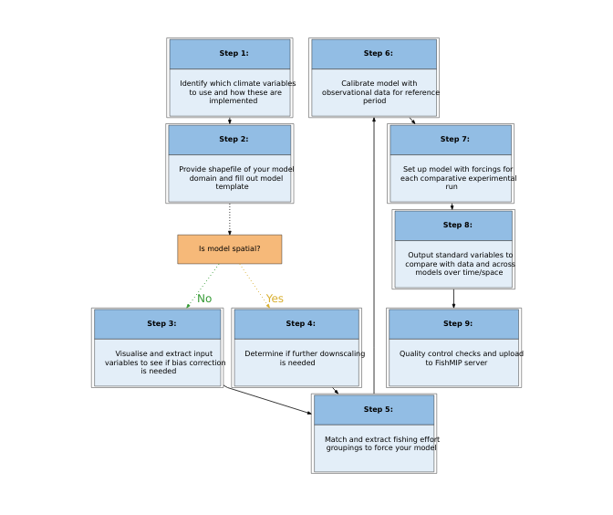

Regional_workflow
================
Denisse Fierro Arcos
2024-02-05

- <a href="#protocol-3a-regional-model-workflow"
  id="toc-protocol-3a-regional-model-workflow">Protocol 3A: Regional model
  workflow</a>
  - <a href="#loading-libraries" id="toc-loading-libraries">Loading
    libraries</a>
  - <a href="#designing-workflow" id="toc-designing-workflow">Designing
    workflow</a>

# Protocol 3A: Regional model workflow

In this notebook, we will create a diagram for the workflow that
regional modelers should follow under FishMIP Protocol 3A.

## Loading libraries

``` r
library(DiagrammeR)
library(DiagrammeRsvg)
library(rsvg)
```

## Designing workflow

<!-- -->

We can now save it as an `svg` image, but first we need to transform
from the original HTML format.

``` r
#Changing from html to svg
svg_workflow <- export_svg(p)

#Saving as svg
writeLines(svg_workflow, "../Outputs/FishMIP_regional_model_workflow.svg")
```

If we prefer, we can change the format from `svg` to `png`.

``` r
rsvg_png("../Outputs/FishMIP_regional_model_workflow.svg", 
         "../Outputs/FishMIP_regional_model_workflow.png")
```
