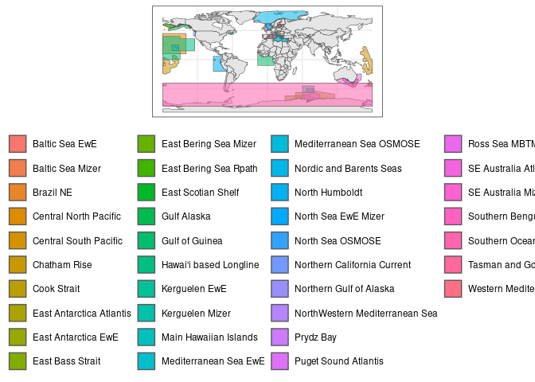

Merging FishMIP Regional Shapefiles
================
Denisse Fierro Arcos
2023-10-31

- <a href="#introduction" id="toc-introduction">Introduction</a>
- <a href="#loading-r-libraries" id="toc-loading-r-libraries">Loading R
  libraries</a>
- <a href="#loading-regional-shapefiles"
  id="toc-loading-regional-shapefiles">Loading regional shapefiles</a>
  - <a href="#getting-list-of-lme-names-from-directory-paths"
    id="toc-getting-list-of-lme-names-from-directory-paths">Getting list of
    LME names from directory paths</a>
  - <a href="#loading-regions" id="toc-loading-regions">Loading regions</a>
  - <a href="#plotting-merged-regions-in-a-map"
    id="toc-plotting-merged-regions-in-a-map">Plotting merged regions in a
    map</a>

# Introduction

In this notebook, we will use shapefiles submitted by all FishMIP
regional modelers to create a single file that can then be used to
create maps or masks to extract Earth System Models (ESMs) outputs.

# Loading R libraries

``` r
#Data manipulation
library(dplyr)
library(stringr)
library(purrr)
#Spatial data
library(sf)
#Plotting data
library(ggplot2)
#Base maps
library(rnaturalearth)
```

# Loading regional shapefiles

Due to the total size of regional shapefiles, it is not possible to
share them in this repository. However, the merged file is available in
the FishMIP THREDDS server. Click
[here](http://portal.sf.utas.edu.au/thredds/catalog/gem/fishmip/FishMIP_regions/catalog.html)
to access this file.

If you need access to regional shapefiles, please [email
us](mailto:fishmip.coordinators@gmail.com).

## Getting list of LME names from directory paths

``` r
#Getting a list of shapefiles in the folder containing the regional model boundaries
region_paths <- list.files("../Shapefiles_Regions", pattern = ".shp$", recursive = T, full.names = T)
#Remove any shapefiles included in "Support Info" folders
region_paths <- region_paths[!str_detect(region_paths, "SupportInfo")]
```

## Loading regions

As of October 2023, there are 23 regional FishMIP models. We will use
the boundaries for all these regions to create a single shapefile that
includes all FishMIP regional models. Having a single file is useful to
create maps showing all regional models easily. This file can also be
used to create masks and extract data from Earth System Models (ESMs).

The regional shapefiles used here have been previously standardised, so
they are easier to merge. All shapefiles now have the following
characteristics:  
- Longitudes range from $-180^{\circ}$ to $180^{\circ}$  
- If a shapefile crosses the international date line, it is split in
two  
- Any internal boundaries were removed  
- All shapefiles have two columns only: `region` and `geometry`  
- The coordinate reference system (CRS) was set to WGS84
([EPSG:4326](https://epsg.io/4326))

``` r
#Loading all files into a list and creating a single shapefile with all regions
regions <- region_paths |> 
  map(read_sf) |> 
  bind_rows() |> 
  mutate(region = str_replace_all(region, "_", " "))
```

## Plotting merged regions in a map

Before we save the merged shapefile, we will create a simple map to
check that all regions are showing correctly. We will use a world
basemap from the `rnaturalearth` package.

``` r
#Loading basemap
world <- ne_countries(returnclass = "sf")

#Plotting regions and map of the world
ggplot()+
  geom_sf(data = world)+
  geom_sf(data = regions, aes(fill = region, alpha = 0.5))+
  theme_bw()+
  theme(legend.position = "bottom", legend.title = element_blank())+
  guides(fill = guide_legend(ncol = 4))
```

<!-- -->

The merged shapefile includes 23 different regions, which matches the
number of regional FishMIP models. We can now save this merged file.

``` r
#Location of folder for outputs
out_folder <- "../Outputs/FishMIP_regional_models"
#If folder does not exist, create one
if(!dir.exists(out_folder)){
  dir.create(out_folder, recursive = T)}

regions |> 
  write_sf(file.path(out_folder, "FishMIP_regional_models.shp"))
```

Remember, the final shapefile is also available in the [FishMIP THREDDS
server](http://portal.sf.utas.edu.au/thredds/catalog/gem/fishmip/FishMIP_regions/catalog.html).
