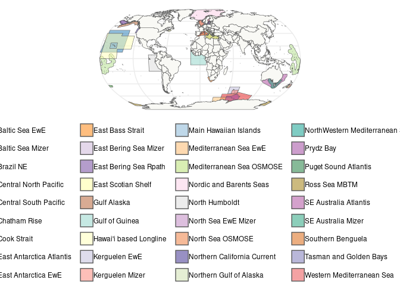
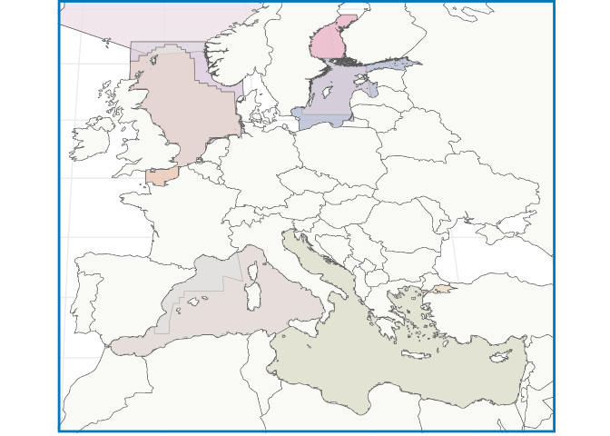
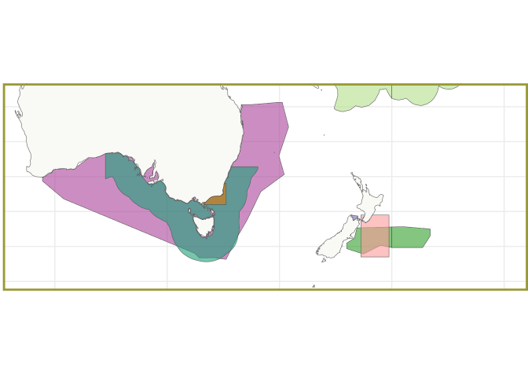
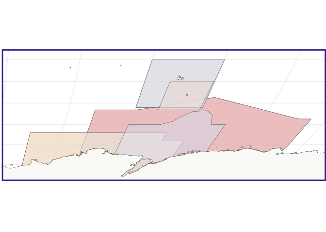
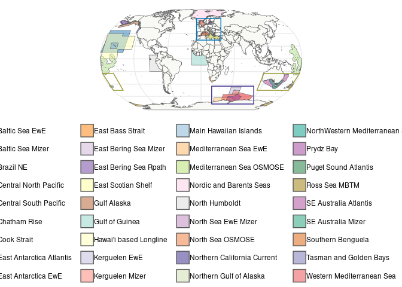
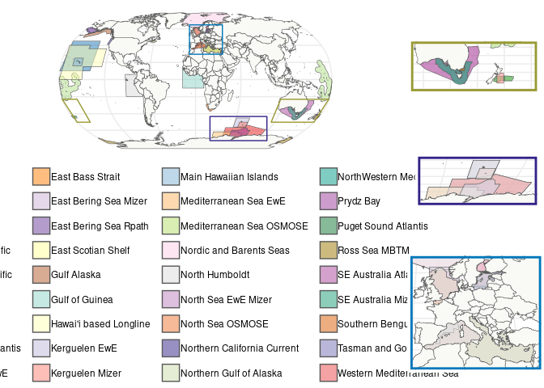

Creating a map with FishMIP regional models
================
Denisse Fierro Arcos
2023-11-01

- <a href="#introduction" id="toc-introduction">Introduction</a>
- <a href="#loading-libraries" id="toc-loading-libraries">Loading
  libraries</a>
- <a href="#downloading-fishmip-regional-models-shapefile-from-thredds"
  id="toc-downloading-fishmip-regional-models-shapefile-from-thredds">Downloading
  FishMIP regional models shapefile from THREDDS</a>
- <a href="#loading-fishmip-regional-models-shapefile"
  id="toc-loading-fishmip-regional-models-shapefile">Loading FishMIP
  regional models shapefile</a>
- <a href="#plotting-map" id="toc-plotting-map">Plotting map</a>
  - <a href="#data-preparation" id="toc-data-preparation">Data
    preparation</a>
  - <a href="#mapping-fishmip-regional-models"
    id="toc-mapping-fishmip-regional-models">Mapping FishMIP regional
    models</a>
    - <a href="#europe" id="toc-europe">Europe</a>
    - <a href="#australia-and-new-zealand"
      id="toc-australia-and-new-zealand">Australia and New Zealand</a>
    - <a href="#southern-ocean" id="toc-southern-ocean">Southern Ocean</a>
    - <a href="#adding-boundaries-of-inset-maps-into-main-map"
      id="toc-adding-boundaries-of-inset-maps-into-main-map">Adding boundaries
      of inset maps into main map</a>
    - <a href="#merging-main-map-with-inset-maps"
      id="toc-merging-main-map-with-inset-maps">Merging main map with inset
      maps</a>
  - <a href="#saving-maps" id="toc-saving-maps">Saving maps</a>

# Introduction

Now that we have a single shapefile with all the FishMIP regional
models, we will create a map that can be used in any publication.

Here, we will show how to access and download the FishMIP regional
models shapefile available from the THREDDS server.

# Loading libraries

``` r
#Connection to THREDDS
library(thredds)
#Downloading data
library(curl)
```

    ## Using libcurl 7.81.0 with GnuTLS/3.7.3

``` r
#Manipulating data
library(dplyr)
```

    ## 
    ## Attaching package: 'dplyr'

    ## The following objects are masked from 'package:stats':
    ## 
    ##     filter, lag

    ## The following objects are masked from 'package:base':
    ## 
    ##     intersect, setdiff, setequal, union

``` r
library(stringr)
#Spatial data
library(sf)
```

    ## Linking to GEOS 3.10.2, GDAL 3.4.1, PROJ 8.2.1; sf_use_s2() is TRUE

``` r
#Base map
library(rnaturalearth)
#Plotting maps
library(ggplot2)
library(cowplot)
library(RColorBrewer)
```

# Downloading FishMIP regional models shapefile from THREDDS

We will use the `HTTPServer` service to download the shapefile files
which are available as a `zip` folder.

**Note** that you only need to download shapefiles once.

``` r
#Defining domain name for THREDDS server
domain <- "http://portal.sf.utas.edu.au"
#Defining location of regional shapefile in THREDDS server
fishmip_reg_cat <- paste0(domain, "/thredds/catalog/gem/fishmip/FishMIP_regions/catalog.xml")

#Getting catalog items available in server
fishmip_reg <- CatalogNode$new(fishmip_reg_cat, prefix = "thredds")

#Getting base url for HTTPServer downloads
base_http <- paste0(domain, fishmip_reg$list_services()$http[["base"]])

#Getting names of datasets available for download
ds_name <- fishmip_reg$get_dataset_names()

#Getting complete download URL
url <- paste0(base_http, fishmip_reg$get_datasets()[[ds_name]]$url)

#Downloading zip file
curl_download(url, destfile = "FishMIP_regions.zip")

#Unzipping folder - storing files in Output folder
out_folder <- "../Outputs"
#If folder does not exist, create one
if(!dir.exists(out_folder)){
  dir.create(out_folder, recursive = T)}
unzip("FishMIP_regions.zip", exdir = out_folder)

#Delete zip folder
unlink("../FishMIP_regions.zip")

#Removing all variables from environment
rm(list = ls())
```

# Loading FishMIP regional models shapefile

Now that we have downloaded the merged shapefiles, we can load it to `R`
and create a map. We will exclude the Southern Ocean region.

``` r
fishmip_reg <- read_sf("../Outputs/FishMIP_regional_models/FishMIP_regional_models.shp") |> 
  filter(region != "Southern Ocean")

#Checking results
fishmip_reg
```

    ## Simple feature collection with 31 features and 3 fields
    ## Geometry type: MULTIPOLYGON
    ## Dimension:     XY
    ## Bounding box:  xmin: -180 ymin: -78.74234 xmax: 180 ymax: 83.66553
    ## Geodetic CRS:  WGS 84
    ## # A tibble: 31 × 4
    ##    region                   models             nmbr_md                  geometry
    ##  * <chr>                    <chr>                <int>        <MULTIPOLYGON [°]>
    ##  1 Baltic Sea EwE           EwE                      1 (((23.5 64.5, 23.5 64.05…
    ##  2 Baltic Sea Mizer         Mizer                    1 (((20.5847 54.93254, 20.…
    ##  3 Brazil NE                EcoSpace                 1 (((-36.94482 -4.549031, …
    ##  4 Central North Pacific    ECOTRAN                  1 (((-140 10, -180 10, -18…
    ##  5 Central South Pacific    Mizer                    1 (((-168.2779 -22.09492, …
    ##  6 Chatham Rise             Atlantis, EwE, Mi…       3 (((172 -45.33333, 172 -4…
    ##  7 Cook Strait              EwE                      1 (((175.209 -40.5, 175.20…
    ##  8 East Antarctica Atlantis Atlantis                 1 (((81.87166 -53.63183, 1…
    ##  9 East Antarctica EwE      EwE                      1 (((80 -64, 80 -68.00585,…
    ## 10 East Bass Strait         EwE                      1 (((150.5 -36, 150.5 -39,…
    ## # ℹ 21 more rows

# Plotting map

Since we removed the Southern Ocean region, we have 31 polygons left.
However, we will need to apply some changes to our datasets to create
publication ready maps.

## Data preparation

We will use a Robinson projection for our map, so we need to reproject
our shapefile. A reprojection also needs to be applied to our base world
map.

We will also create a an original colour map to plot the FishMIP regions
using a combination of `RColorBrewer` palettes. We will add this
information to the reprojected regional shapefile for plotting.

``` r
#Define Robinson projection to be applied to shapefile and basemap
rob_proj <- "+proj=robin +lon_0=0 +x_0=0 +y_0=0 +datum=WGS84 +units=m +no_defs +type=crs"

#Load world base map
world <- ne_countries(scale = "medium", returnclass = "sf") |> 
  #Ensuring any polygons crossing international dateline are correctly plotted
  st_wrap_dateline() |> 
  #Reprojecting
  st_transform(rob_proj)

#Creating a colour palette by merging colour brewer palettes
pal <- c("#ee3377", brewer.pal(12, "Paired"), brewer.pal(8, "Set2"), 
         "#ee7733", "#332288", "#ccddaa", "#009988", 
         "#117733", "#997700", "#aa4499", brewer.pal(3, "Dark2"))

#Reprojecting FishMIP regions
fishmip_reg_rob <- fishmip_reg |> 
  #Adding colour palette
  mutate(fill = pal) |> 
  st_wrap_dateline() |> 
  st_transform(rob_proj)
```

## Mapping FishMIP regional models

Since there is some overlap in the spatial coverage for regional models,
we will create maps showing more detail in the overlapping regions.

First, we will plot all regional models. We will use this as the main
map.

``` r
#Plotting 
reg <- fishmip_reg_rob |> 
  #Plotting
  ggplot()+
  #Using colours of our tailored made colourmap
  geom_sf(aes(fill = region), alpha = 0.5)+
  geom_sf(data = world, fill = "#f9f9f5", show.legend = F)+
  scale_fill_manual(values = fishmip_reg_rob$fill)+
  theme_bw()+
  #Move legend to bottom
  theme(legend.position = "bottom", legend.title = element_blank(),
        legend.margin = margin(0, 0, 0, 0),
        legend.box.margin = margin(0, 0, 0, 0),
        legend.text = element_text(margin = margin(r = 5)),
        panel.border = element_rect(colour = NA))+
  #Split legend into four columns
  guides(fill = guide_legend(ncol = 4))

#Checking map so far
reg
```

<!-- -->

Our initial maps shows all FishMIP regions, but does not look great yet.
We will use this as a guide to identify the areas where we will create
the smaller maps. We will expand the following areas:  
- Europe  
- Australia and New Zealand  
- East Antarctica

We will use the base map above to create these smaller maps.

### Europe

``` r
europe <- reg+
  #We will increase transparency to see overlapping areas better
  geom_sf(inherit.aes = T, aes(alpha = 0.5))+
  #Remove background
  theme_bw()+
  #Remove legend
  theme(legend.position = "none")+
  #Add world base map
  geom_sf(data = world, fill = "#f9f9f5")+
  #Focus on Europe. Note that we use coordinates in meters because data is reprojected
  lims(x = c(-741458, 3251458), y = c(3256289, 6725154))+
  #Add a border to map so it is easily identifiable
  theme(panel.border = element_rect(colour = "#0077bb", linewidth = 2),
        axis.text = element_blank(), axis.ticks = element_blank(),
        plot.margin = margin(0, 0, 0, 0, unit = "cm"))

#Create a shapefile with map limits
eu_box <- st_bbox(c(xmin = -751458, xmax = 3351458, ymax = 6825154, ymin = 3156289), 
                  crs = rob_proj) |> 
  st_as_sfc()

#Check map of Europe
europe
```

<!-- -->

### Australia and New Zealand

Because one of the regions in New Zealand crosses the international date
line, we will show this area in an unprojected map.

``` r
au_nz <- fishmip_reg |>
  #Switching to 0-360 degrees longitude
  st_shift_longitude() |>
  ggplot()+
  #We will increase transparency to see overlapping areas better
  geom_sf(aes(fill = region), alpha = 0.5)+
  #Add world base map
  geom_sf(inherit.aes = F, data = world, fill = "#f9f9f5", show.legend = F)+
  #Focus on Australia and New Zealand
  lims(x = c(115, 200), y = c(-50, -23))+
  scale_fill_manual(values = fishmip_reg_rob$fill)+
  #Remove background
  theme_bw()+
  #Remove legend
  theme(legend.position = "none")

#Adding Bass Strait on top so it is easier to see
#Extract Bass Strait region
Tas <- fishmip_reg |> 
  filter(str_detect(region, "Bass")) |> 
  mutate(fill = "#CAB2D6")

#Plot Bass Strait over the original AU/NZ map
au_nz <- au_nz+
  geom_sf(inherit.aes = F, data = Tas, aes(fill = region), alpha = 0.5)+
  scale_fill_manual(values = fishmip_reg_rob$fill)+
  #Remove background
  theme_bw()+
  #Remove legend
  theme(legend.position = "none")+
  #Add a border to map so it is easily identifiable
  theme(panel.border = element_rect(colour = "#999933", linewidth = 2),
        axis.text = element_blank(), axis.ticks = element_blank(),
        plot.margin = margin(0, 0, 0, 0, unit = "cm"))
```

    ## Scale for fill is already present.
    ## Adding another scale for fill, which will replace the existing scale.

``` r
#Create a shapefile with map limits
au_nz_box <- st_union(st_bbox(c(xmin = 115, xmax = 180, ymax = -23, ymin = -50),
                              crs = 4326) |> st_as_sfc(),
                      st_bbox(c(xmin = -180, xmax = 200, ymax = -23, ymin = -50),
                              crs = 4326) |>  st_as_sfc()) |> 
  #Projecting to Robinson
  st_transform(rob_proj)

#Check map
au_nz
```

<!-- -->

### Southern Ocean

``` r
so <- reg+
  #We will increase transparency to see overlapping areas better
  geom_sf(inherit.aes = T, aes(alpha = 0.5))+
  #Remove background
  theme_bw()+
  #Remove legend
  theme(legend.position = "none")+
  #Add world base map
  geom_sf(data = world, fill = "#f9f9f5")+
  #Focus on Australia and New Zealand
  lims(x = c(1900000, 8800000), y = c(-7525154, -4712577))+
  #Add a border to map so it is easily identifiable
  theme(panel.border = element_rect(colour = "#332288", linewidth = 2),
        axis.text = element_blank(), axis.ticks = element_blank(),
        plot.margin = margin(0, 0, 0, 0, unit = "cm"))

#Create a shapefile with map limits
so_box <- st_bbox(c(xmin = 1800000, xmax = 8900000, ymax = -4612577, ymin = -7625154),
                  crs = rob_proj) |>
  st_as_sfc()

#Check map
so
```

<!-- -->

### Adding boundaries of inset maps into main map

``` r
main <- reg+
  geom_sf(data = eu_box, color = "#0077bb", fill = NA, linewidth = 0.5)+
  geom_sf(data = au_nz_box, color = "#999933", fill = NA, linewidth = 0.5)+
  geom_sf(data = so_box, color = "#332288", fill = NA, linewidth = 0.5)

main
```

<!-- -->

### Merging main map with inset maps

``` r
#Merging main map and insets
final_map <- ggdraw(main)+
  draw_plot(au_nz, x = .805, y = 0.675, width = 0.185, height = 0.3)+
  draw_plot(so, x = .815, y = 0.38, width = 0.175, height = 0.30)+
  draw_plot(europe, x = .75, y = 0.04, width = 0.3, height = 0.3)

final_map <- final_map+
  theme(plot.margin = margin(l = -5, unit = "cm"))

#Checking final result
final_map
```

<!-- -->

The map above may not look great in your screen, but once it is saved to
your local machine, it will plot correctly. However, you can change the
code here to fit it to your needs.

## Saving maps

The final map can be saved to your local machine. We will save it as
vector image so it still looks good even when expanded. You can also
find a copy of this image in the [FishMIP THREDDS
server](http://portal.sf.utas.edu.au/thredds/catalog/gem/fishmip/catalog.html).

``` r
#Saving final map
ggsave("../Outputs/FishMIP_regional_models_insets.pdf", final_map, 
       device = "pdf", width = 25, height = 15, units = "cm")

#Saving main map with just regions and no insets
ggsave("../Outputs/FishMIP_regional_models.pdf", reg, device = "pdf", 
       width = 9)
```

    ## Saving 9 x 5 in image
