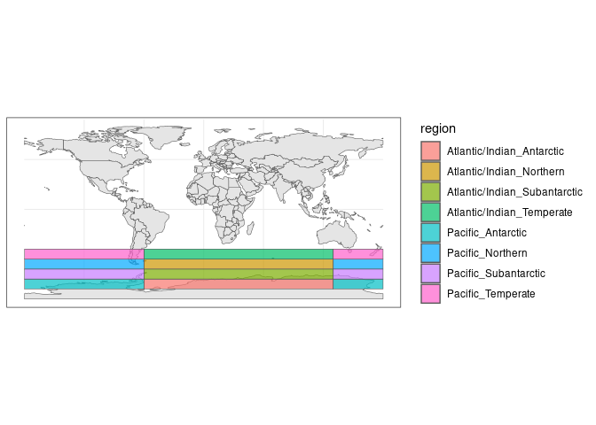
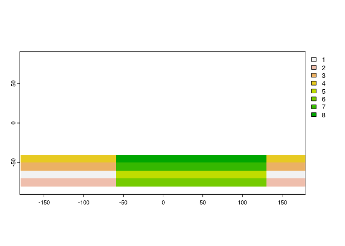

Creating_raster_mask
================
Denisse Fierro Arcos
2023-11-06

- <a href="#introduction" id="toc-introduction">Introduction</a>
- <a href="#loading-libraries" id="toc-loading-libraries">Loading
  libraries</a>
- <a href="#loading-southern-ocean-shapefile"
  id="toc-loading-southern-ocean-shapefile">Loading Southern Ocean
  shapefile</a>
- <a href="#finding-location-of-raster-samples"
  id="toc-finding-location-of-raster-samples">Finding location of raster
  samples</a>
- <a href="#plotting-mask" id="toc-plotting-mask">Plotting mask</a>

## Introduction

In this notebook, we will show how to create a raster mask that can be
used to extract data from Earth System Models. Here, we will use the
shapefile for the Southern Ocean MICE regional model. This regional
model contains some internal boundaries that do not overlap. We will
create two-dimensional masks that will match the various grids used in
the Fish-MIP project.

# Loading libraries

``` r
#Spatial data
library(sf)
```

    ## Linking to GEOS 3.10.2, GDAL 3.4.1, PROJ 8.2.1; sf_use_s2() is TRUE

``` r
library(terra)
```

    ## terra 1.7.18

``` r
#Manipulating and plotting data
library(tidyverse)
```

    ## ── Attaching core tidyverse packages ──────────────────────── tidyverse 2.0.0 ──
    ## ✔ dplyr     1.1.1     ✔ readr     2.1.4
    ## ✔ forcats   1.0.0     ✔ stringr   1.5.0
    ## ✔ ggplot2   3.4.1     ✔ tibble    3.2.1
    ## ✔ lubridate 1.9.2     ✔ tidyr     1.3.0
    ## ✔ purrr     1.0.1

    ## ── Conflicts ────────────────────────────────────────── tidyverse_conflicts() ──
    ## ✖ tidyr::extract() masks terra::extract()
    ## ✖ dplyr::filter()  masks stats::filter()
    ## ✖ dplyr::lag()     masks stats::lag()
    ## ℹ Use the conflicted package (<http://conflicted.r-lib.org/>) to force all conflicts to become errors

``` r
#Base map
library(rnaturalearth)
```

# Loading Southern Ocean shapefile

Given that some subregions cross the international date line, the
shapefile contains two polygons corresponding to the same region. We
will assign a unique ID for each region, which will ensure that if there
are two polygons for a region, they will be classified as that region.

``` r
#Loading shapefile
southern_ocean <- read_sf("../Shapefiles_Regions/Southern-Ocean_MICE/SupportInfo/SouthernOcean_MICE.shp") |> 
  #Uniting region and band columns
  unite("region", region, band)

#Create a unique ID for each region
so_id <- southern_ocean |> 
  distinct(region) |> 
  rowid_to_column("id")

#Adding unique ID to shapefile
southern_ocean <- southern_ocean |> 
  left_join(so_id, by = "region")

#Checking result
ne_countries(returnclass = "sf") |> 
  ggplot()+
  geom_sf()+
  geom_sf(inherit.aes = F, data = southern_ocean, aes(fill = region), alpha = 0.7)+
  theme_bw()
```

<!-- -->

The Southern Ocean regions are plotting correctly, now we can move onto
creating raster masks. In total, we will create four different masks to
match all inputs and outputs used in Fish-MIP.

# Finding location of raster samples

We have a folder containing samples of the raster used in Fish-MIP
models and ESMs. We will list all the files contained in that folder.

``` r
sample_rasters <- list.files("../ESM_Sample_Data/", pattern = ".nc$", full.names = T)
sample_rasters
```

    ## [1] "../ESM_Sample_Data//area_025deg.nc"   
    ## [2] "../ESM_Sample_Data//area_05deg.nc"    
    ## [3] "../ESM_Sample_Data//area_1deg_DBPM.nc"
    ## [4] "../ESM_Sample_Data//area_1deg.nc"

We will define a function that will go through each sample file and
create a mask.

``` r
shp_to_raster <- function(shp, raster_path, out_folder){
  #Transforming shapefile to SpatVector class
  shp_terra <- vect(shp)
  #Loading raster
  ras <- rast(raster_path)
  #Rasterise shapefile
  shp_rast <- rasterize(shp_terra, ras, field = "id", background = NA)
  #Create name for mask to be saved from original raster sample
  file_out <- paste0("Southern_Ocean_mask", 
                     str_extract(raster_path, "area(_.*nc)", group = 1))
  file_out <- file.path(out_folder, file_out)
  writeCDF(shp_rast, file_out, overwrite = T, varname = "region", 
           longname = "regions of the SO", missval = NA)
}
```

Applying function to all raster samples.

``` r
#Ensure output folder exists
out_folder <- "../Outputs/SouthernOceanMasks"
if(!dir.exists(out_folder)){
  dir.create(out_folder, recursive = T)}

#Applying function creating masks
for(ras in sample_rasters){
  shp_to_raster(southern_ocean, ras, out_folder)
}
```

# Plotting mask

We will plot one mask to ensure it has been correctly created.

``` r
ras <- rast("../Outputs/SouthernOceanMasks/Southern_Ocean_mask_1deg_DBPM.nc")
plot(ras)
```

<!-- -->

The final mask matches the region, which is exactly what we needed. We
are now going to save a data frame containing the name of the Southern
Ocean regions and their unique ID so they can be easily interpreted.

``` r
southern_ocean |> 
  st_drop_geometry() |> 
  distinct() |> 
  write_csv(file.path(out_folder, "Southern_Ocean_region_keys.csv"))
```

We can now use these masks to extract data from any rasters sharing the
same grid as the mask.
