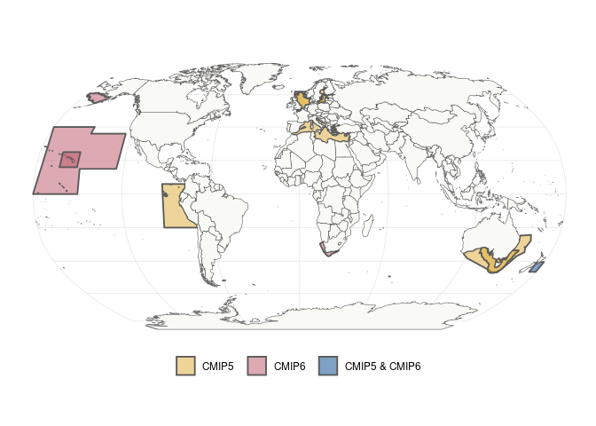

CMIP_contributions
================
Denisse Fierro Arcos
2024-01-10

- <a href="#map-comparing-regional-models-by-cmip-version"
  id="toc-map-comparing-regional-models-by-cmip-version">Map comparing
  regional models by CMIP version</a>
  - <a href="#loading-libraries" id="toc-loading-libraries">Loading
    libraries</a>
  - <a href="#loading-fishmip-regional-models-shapefile"
    id="toc-loading-fishmip-regional-models-shapefile">Loading FishMIP
    regional models shapefile</a>
    - <a href="#data-preparation" id="toc-data-preparation">Data
      preparation</a>
  - <a href="#plotting-map" id="toc-plotting-map">Plotting map</a>
    - <a href="#saving-map-to-disk" id="toc-saving-map-to-disk">Saving map to
      disk</a>

# Map comparing regional models by CMIP version

## Loading libraries

``` r
#Manipulating data
library(dplyr)
```

    ## 
    ## Attaching package: 'dplyr'

    ## The following objects are masked from 'package:stats':
    ## 
    ##     filter, lag

    ## The following objects are masked from 'package:base':
    ## 
    ##     intersect, setdiff, setequal, union

``` r
library(stringr)
library(fuzzyjoin)
#Spatial data
library(sf)
```

    ## Linking to GEOS 3.10.2, GDAL 3.4.1, PROJ 8.2.1; sf_use_s2() is TRUE

``` r
#Base map
library(rnaturalearth)
#Plotting maps
library(ggplot2)
library(cowplot)
library(RColorBrewer)
```

## Loading FishMIP regional models shapefile

``` r
#Creating data frame with regional models to be included
cmip_model <- tibble(region = c("Baltic Sea", "Humboldt", "Mediterranean", "North Sea", "SE Australia",
                                "Benguela", "East Bering", "Hawaii",
                                "Cook Strait", "East Bass"),
                     #CMIP version used
                     esm = c(rep("CMIP5", 5), rep("CMIP6", 3), rep("CMIP5 & CMIP6", 2))) |> 
  mutate(esm = factor(esm, ordered = T, levels = c("CMIP5", "CMIP6", "CMIP5 & CMIP6")))

#Selecting regional models based on data frame above
cmip_comp <- read_sf("../Outputs/FishMIP_regional_models/FishMIP_regional_models.shp") |> 
  #Partial match of region name
  fuzzy_inner_join(cmip_model, by = "region", match_fun = str_detect) |> 
  #Remove second "region" column because it does not contain full names
  select(!region.y) |> 
  #Rename original "region" column
  rename("region" = "region.x")

#Checking results
cmip_comp
```

    ## Simple feature collection with 14 features and 4 fields
    ## Geometry type: MULTIPOLYGON
    ## Dimension:     XY
    ## Bounding box:  xmin: -180 ymin: -47.19364 xmax: 179.5 ymax: 64.5
    ## Geodetic CRS:  WGS 84
    ## # A tibble: 14 × 5
    ##    region                models          nmbr_md                  geometry esm  
    ##    <chr>                 <chr>             <int>        <MULTIPOLYGON [°]> <ord>
    ##  1 Baltic Sea EwE        EwE                   1 (((23.5 64.5, 23.5 64.05… CMIP5
    ##  2 Baltic Sea Mizer      Mizer                 1 (((20.5847 54.93254, 20.… CMIP5
    ##  3 Benguela              Atlantis, EwE,…       3 (((19.90119 -36.77948, 1… CMIP6
    ##  4 Cook Strait           EwE                   1 (((175.209 -40.5, 175.20… CMIP…
    ##  5 East Bass Strait      EwE                   1 (((150.5 -36, 150.5 -39,… CMIP…
    ##  6 East Bering Sea       Mizer                 1 (((-165.61 54.51, -165.6… CMIP6
    ##  7 Hawaiian Longline     Mizer                 1 (((-150 40, -150 36, -12… CMIP6
    ##  8 Main Hawaiian Islands ECOTRAN               1 (((-152 16.00012, -164 1… CMIP6
    ##  9 Mediterranean Sea     EwE                   1 (((29.05594 41.0923, 29.… CMIP5
    ## 10 North Humboldt        OSMOSE                1 (((-77.3643 6, -77.3643 … CMIP5
    ## 11 North Sea EwE Mizer   EwE, Mizer            2 (((4.99375 62, 4.995313 … CMIP5
    ## 12 North Sea OSMOSE      OSMOSE                1 (((1.5 61.75, 1.5 61.5, … CMIP5
    ## 13 SE Australia Atlantis Atlantis              1 (((117.8 -35.4699, 117.8… CMIP5
    ## 14 SE Australia Mizer    Mizer                 1 (((130.8023 -31.65674, 1… CMIP5

### Data preparation

We will use a Robinson projection for our map, so we need to reproject
our shapefile. A reprojection also needs to be applied to our base world
map.

``` r
#Define Robinson projection to be applied to shapefile and basemap
rob_proj <- "+proj=robin +lon_0=0 +x_0=0 +y_0=0 +datum=WGS84 +units=m +no_defs +type=crs"

#Load world base map
world <- ne_countries(scale = "medium", returnclass = "sf") |> 
  #Ensuring any polygons crossing international dateline are correctly plotted
  st_wrap_dateline() |> 
  #Reprojecting
  st_transform(rob_proj)

#Reprojecting FishMIP regions
cmip_comp_rob <- cmip_comp |> 
  st_wrap_dateline() |> 
  st_transform(rob_proj)
```

## Plotting map

``` r
#Plotting 
reg <- cmip_comp_rob |> 
  #Plotting
  ggplot()+
  #Color regions by CMIP version used
  geom_sf(aes(fill = esm), alpha = 0.5, linewidth = 0.65)+
  geom_sf(data = world, fill = "#f9f9f5", show.legend = F)+
  #Selecting colourblind friendly colours
  scale_fill_manual(values = c("#ddaa33", "#bb5566", "#004488"))+
  theme_bw()+
  #Move legend to bottom
  theme(legend.position = "bottom", legend.title = element_blank(),
        legend.margin = margin(0, 0, 0, 0),
        legend.box.margin = margin(0, 0, 0, 0),
        legend.text = element_text(margin = margin(r = 5)),
        panel.border = element_rect(colour = NA))+
  #Split legend into four columns
  guides(fill = guide_legend(nrow = 1))

#Checking map so far
reg
```

<!-- -->

### Saving map to disk

``` r
#Saving final map
ggsave("../Outputs/FishMIP_regional_models_cmip_comparison.pdf", reg, device = "pdf", 
       width = 18.75, height = 15, units = "cm")
```
