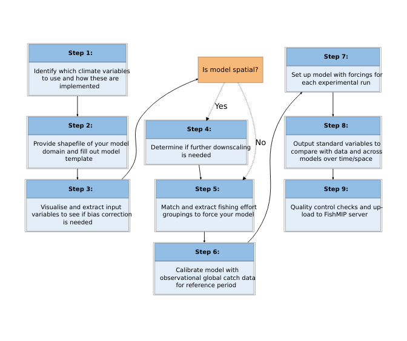

Regional_workflow
================
Denisse Fierro Arcos
2024-02-05

- <a href="#protocol-3a-regional-model-workflow"
  id="toc-protocol-3a-regional-model-workflow">Protocol 3A: Regional model
  workflow</a>
  - <a href="#loading-libraries" id="toc-loading-libraries">Loading
    libraries</a>
  - <a href="#designing-workflow" id="toc-designing-workflow">Designing
    workflow</a>

# Protocol 3A: Regional model workflow

In this notebook, we will create a diagram for the workflow that
regional modelers should follow under FishMIP Protocol 3A.

## Loading libraries

``` r
library(DiagrammeR)
library(DiagrammeRsvg)
library(rsvg)
```

## Designing workflow

``` r
p <- grViz("digraph git_basics {
graph [
      margin = '0,0'
      newrank = true
      nodesep = 0.4
      ranksep = 0.8
      overlap = true
      rankdir = TB
      ]
      
node [
      shape = rectangle
      style = filled
      fillcolor = 'white'
      fontname = 'Helvetica,Arial,sans-serif'
      fontsize = 35
      width = 5
      ]
      
edge [
      fontname = 'Helvetica,Arial,sans-serif'
      fontsize = 35
      labelfontcolor = '#00000080'
      penwidth = 3
      shape = 'record']

Step_1[label = <<table border='0' cellborder='1' cellspacing='0' cellpadding='28'>
            <tr> <td bgcolor = '#92bde4'> <b>Step 1:</b><br/></td> </tr>
            <tr> <td bgcolor = '#e3eef8'>Identify which climate variables<br/>
            to use and how these are<br/>
            implemented<br/>
            </td> </tr>
        </table>>]
Step_2 [label = <<table border='0' cellborder='1' cellspacing='0' cellpadding='28'>
            <tr> <td bgcolor = '#92bde4'> <b>Step 2:</b><br/></td> </tr>
            <tr> <td bgcolor = '#e3eef8'>Provide shapefile of your model<br/>
            domain and fill out model<br/>
            template<br/>
            </td> </tr>
        </table>>]
Step_n [label = '\nIs model spatial?\n\n' fillcolor = '#f6b979' fontsize = 38]
Step_3 [label = <<table border='0' cellborder='1' cellspacing='0' cellpadding='28'>
            <tr> <td bgcolor = '#92bde4'> <b>Step 3:</b><br/></td> </tr>
            <tr> <td bgcolor = '#e3eef8'>Visualise and extract input<br/>
            variables to see if bias correction<br/>
             is needed<br/>
            </td> </tr>
        </table>>]
Step_4 [label = <<table border='0' cellborder='1' cellspacing='0' cellpadding='28'>
            <tr> <td bgcolor = '#92bde4'> <b>Step 4:</b><br/></td> </tr>
            <tr> <td bgcolor = '#e3eef8'>Determine if further downscaling<br/>
             is needed<br/>
            </td> </tr>
        </table>>]
Step_5 [label = <<table border='0' cellborder='1' cellspacing='0' cellpadding='28'>
            <tr> <td bgcolor = '#92bde4'> <b>Step 5:</b><br/></td> </tr>
            <tr> <td bgcolor = '#e3eef8'>Match and extract fishing effort<br/>
            groupings to force your model<br/>
            <br/>
            </td> </tr>
        </table>>
        tooltip = 'Step 5:']
Step_6 [label = <<table border='0' cellborder='1' cellspacing='0' cellpadding='28'>
            <tr> <td bgcolor = '#92bde4'> <b>Step 6:</b><br/></td> </tr>
            <tr> <td bgcolor = '#e3eef8'>Calibrate model with<br/>
             observational global catch data<br/>
             for reference period<br/>
            </td> </tr>
        </table>>]
Step_7 [label = <<table border='0' cellborder='1' cellspacing='0' cellpadding='28'>
            <tr> <td bgcolor = '#92bde4'> <b>Step 7:</b><br/></td> </tr>
            <tr> <td bgcolor = '#e3eef8'>Set up model with forcings for<br/>
            each experimental run<br/>
            </td> </tr>
        </table>>
        tooltip = 'Step 7:']
Step_8 [label = <<table border='0' cellborder='1' cellspacing='0' cellpadding='28'>
            <tr> <td bgcolor = '#92bde4'> <b>Step 8:</b><br/></td> </tr>
            <tr> <td bgcolor = '#e3eef8'>Output standard variables to<br/>
            compare with data and across<br/>
            models over time/space<br/>
            </td> </tr>
        </table>>]
Step_9 [label = <<table border='0' cellborder='1' cellspacing='0' cellpadding='28'>
            <tr> <td bgcolor = '#92bde4'> <b>Step 9:</b><br/></td> </tr>
            <tr> <td bgcolor = '#e3eef8'>Quality control checks and up-<br/>
            load to FishMIP server<br/>
            <br/>
            </td> </tr>
        </table>>]

subgraph sub_1 {
  Step_1 -> Step_2 -> Step_3
  Step_3 -> Step_n [weight = 0.5 curve = basis]
}

subgraph sub_2 {
  Step_n -> Step_4 [label = 'Yes' style = dotted penwidth = 6 fontsize = 45
                    fontname = 'bold Helvetica,Arial,sans-serif']
  Step_n -> Step_5 [label = 'No' style = dotted penwidth = 6 fontsize = 45
                    fontname = 'bold Helvetica,Arial,sans-serif']
  Step_4 -> Step_5 
  Step_5 -> Step_6 
  Step_6 -> Step_7 [weight = 0.5 curve = basis]
}

subgraph sub_3 {
  Step_7 -> Step_8 -> Step_9
}

subgraph sub_4 {
  graph [rank = same]
  edge [style = invis, weight = 0.1]
  Step_1 -> Step_n
  Step_n -> Step_7
}


}",
width = "100%", height = "100%")

p
```

<!-- -->

We can now save it as an `svg` image, but first we need to transform
from the original HTML format.

``` r
#Changing from html to svg
svg_workflow <- export_svg(p)

#Saving as svg
writeLines(svg_workflow, "../outputs/FishMIP_regional_model_workflow.svg")
```

If we prefer, we can change the format from `svg` to `png`.

``` r
rsvg_png("../outputs/FishMIP_regional_model_workflow.svg", 
         "../outputs/FishMIP_regional_model_workflow.png")
```
