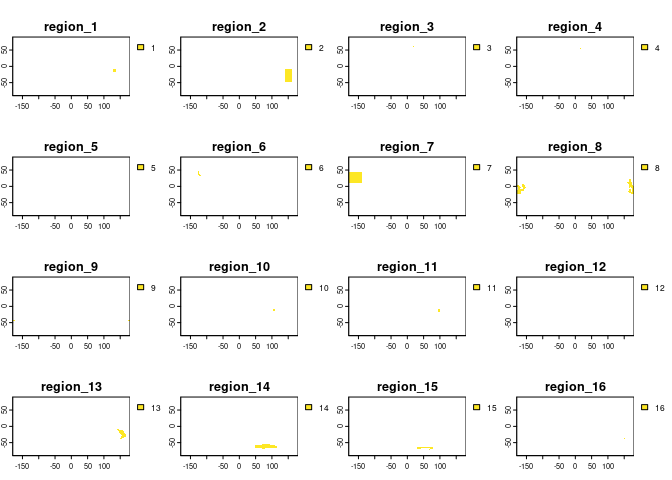
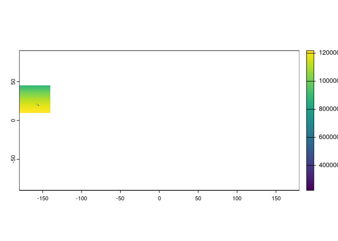

Creating_multidimensional_raster_mask
================
Denisse Fierro Arcos
2023-11-27

- <a href="#introduction" id="toc-introduction">Introduction</a>
- <a href="#loading-libraries" id="toc-loading-libraries">Loading
  libraries</a>
- <a href="#loading-fishmip-regional-models-shapefile"
  id="toc-loading-fishmip-regional-models-shapefile">Loading FishMIP
  regional models shapefile</a>
- <a href="#finding-location-of-raster-samples"
  id="toc-finding-location-of-raster-samples">Finding location of raster
  samples</a>
- <a href="#plotting-mask" id="toc-plotting-mask">Plotting mask</a>
- <a href="#saving-raster-mask-keys"
  id="toc-saving-raster-mask-keys">Saving raster mask keys</a>
  - <a href="#how-to-use-raster-mask" id="toc-how-to-use-raster-mask">How to
    use raster mask</a>
- <a href="#data-frame-mask" id="toc-data-frame-mask">Data frame mask</a>
  - <a href="#how-to-use-data-frame-mask"
    id="toc-how-to-use-data-frame-mask">How to use data frame mask</a>

## Introduction

In this notebook, we will show how to create a multidimensional raster
mask that can be used to extract data from Earth System Models from the
Fish-MIP regional models shapefile. We create a multidimensional mask
because there are multiple overlapping regions. We will create
three-dimensional masks that will match the various grids used in the
Fish-MIP project, as well as a mask in table format (i.e., data frame).

# Loading libraries

``` r
#Spatial data
library(sf)
library(terra)
library(stars)

#Manipulating and plotting data
library(tidyverse)

#Base map
library(rnaturalearth)
```

# Loading FishMIP regional models shapefile

We will load the shapefile with all Fish-MIP regional model boundaries
and add a unique ID identifying each region.

``` r
#Loading shapefile
regions <- file.path("/rd/gem/private/shared_resources/",
                     "FishMIP_regional_models/FishMIP_regional_models.shp") |> 
  read_sf() |> 
  #Create a unique ID for each region
  rowid_to_column("id")

#Checking result
ne_countries(returnclass = "sf") |> 
  ggplot()+
  geom_sf()+
  geom_sf(inherit.aes = F, data = regions, aes(fill = region), alpha = 0.7)+
  theme_bw()
```

<!-- -->

Our shapefile is plotting correctly, now we can move onto creating
raster masks. In total, we will create four different multidimensional
raster masks to match all data available as forcings for Fish-MIP
models.

# Finding location of raster samples

We have a folder containing samples of the raster used in Fish-MIP
models and ESMs. We will list all the files contained in that folder.

``` r
#Directory containing sample rasters
samples_dir <- "/rd/gem/private/shared_resources/grid_cell_area_ESMs"

#Getting a list of sample rasters in the isimip folders
sample_rasters <- list.files(samples_dir, pattern = ".nc$", full.names = T,
                             recursive = T) |> 
  str_subset("isimip")

#Checking results
sample_rasters
```

    ## [1] "/rd/gem/private/shared_resources/grid_cell_area_ESMs/isimip3a/gfdl-mom6-cobalt2_areacello_15arcmin_global_fixed.nc"        
    ## [2] "/rd/gem/private/shared_resources/grid_cell_area_ESMs/isimip3a/gfdl-mom6-cobalt2_areacello_60arcmin_global_fixed.nc"        
    ## [3] "/rd/gem/private/shared_resources/grid_cell_area_ESMs/isimip3b/gfdl-esm4_areacello_w-fractions_60arcmin_global_fixed.nc"    
    ## [4] "/rd/gem/private/shared_resources/grid_cell_area_ESMs/isimip3b/ipsl-cm6a-lr_areacello_wo-fractions_60arcmin_global_fixed.nc"

We will define a function that will go through each sample file and
create a mask.

``` r
shp_to_raster <- function(shp, raster_path){
  #Transforming shapefile to SpatVector class
  shp_terra <- vect(shp)
  #Loading raster
  ras <- rast(raster_path)
  #Rasterise shapefile
  shp_rast <- rasterize(shp_terra, ras, field = "id", background = NA)
  return(shp_rast)
}
```

Before applying the function, we will make sure that an output folder
exists, if not, we will create one.

``` r
#Ensure output folder exists
out_folder <- "/rd/gem/private/shared_resources/FishMIPMasks"
if(!dir.exists(out_folder)){
  dir.create(out_folder, recursive = T)}

#Storing each region inside the regions shapefile as an element of a list
region_list <- split(regions, 1:nrow(regions))
```

Applying function to all raster samples.

``` r
#Applying function creating masks
for(ras in sample_rasters){
  stack_list <- map(region_list, shp_to_raster, ras)
  stack <- rast(stack_list)
  #Create name for mask to be saved from original raster sample
  file_out <- str_replace(basename(ras), 
                          "global", "fishMIP_regional_mask")
  file_out <- file.path(out_folder, file_out)
  #Save multi dimensional raster mask
  writeCDF(stack, file_out, overwrite = T, varname = "region",
           longname = "Fish-MIP regions", missval = NA)
}
```

# Plotting mask

We will plot one mask to ensure it has been correctly created.

``` r
ras <- rast(list.files("/rd/gem/private/shared_resources/FishMIPMasks", 
                       "w-fractions.*nc", full.names = T))
```

    ## Warning in new_CppObject_xp(fields$.module, fields$.pointer, ...): GDAL Message
    ## 1: dimension #0 (time) is not a Time or Vertical dimension.

``` r
plot(ras)
```

    ## Warning in x@ptr$readStart(): GDAL Message 1: dimension #0 (time) is not a Time
    ## or Vertical dimension.

    ## Warning in x@ptr$readStart(): GDAL Message 1: dimension #0 (time) is not a Time
    ## or Vertical dimension.
    ## Warning in x@ptr$readStart(): GDAL Message 1: dimension #0 (time) is not a Time
    ## or Vertical dimension.
    ## Warning in x@ptr$readStart(): GDAL Message 1: dimension #0 (time) is not a Time
    ## or Vertical dimension.
    ## Warning in x@ptr$readStart(): GDAL Message 1: dimension #0 (time) is not a Time
    ## or Vertical dimension.
    ## Warning in x@ptr$readStart(): GDAL Message 1: dimension #0 (time) is not a Time
    ## or Vertical dimension.
    ## Warning in x@ptr$readStart(): GDAL Message 1: dimension #0 (time) is not a Time
    ## or Vertical dimension.
    ## Warning in x@ptr$readStart(): GDAL Message 1: dimension #0 (time) is not a Time
    ## or Vertical dimension.
    ## Warning in x@ptr$readStart(): GDAL Message 1: dimension #0 (time) is not a Time
    ## or Vertical dimension.
    ## Warning in x@ptr$readStart(): GDAL Message 1: dimension #0 (time) is not a Time
    ## or Vertical dimension.
    ## Warning in x@ptr$readStart(): GDAL Message 1: dimension #0 (time) is not a Time
    ## or Vertical dimension.
    ## Warning in x@ptr$readStart(): GDAL Message 1: dimension #0 (time) is not a Time
    ## or Vertical dimension.
    ## Warning in x@ptr$readStart(): GDAL Message 1: dimension #0 (time) is not a Time
    ## or Vertical dimension.
    ## Warning in x@ptr$readStart(): GDAL Message 1: dimension #0 (time) is not a Time
    ## or Vertical dimension.
    ## Warning in x@ptr$readStart(): GDAL Message 1: dimension #0 (time) is not a Time
    ## or Vertical dimension.
    ## Warning in x@ptr$readStart(): GDAL Message 1: dimension #0 (time) is not a Time
    ## or Vertical dimension.
    ## Warning in x@ptr$readStart(): GDAL Message 1: dimension #0 (time) is not a Time
    ## or Vertical dimension.
    ## Warning in x@ptr$readStart(): GDAL Message 1: dimension #0 (time) is not a Time
    ## or Vertical dimension.
    ## Warning in x@ptr$readStart(): GDAL Message 1: dimension #0 (time) is not a Time
    ## or Vertical dimension.
    ## Warning in x@ptr$readStart(): GDAL Message 1: dimension #0 (time) is not a Time
    ## or Vertical dimension.
    ## Warning in x@ptr$readStart(): GDAL Message 1: dimension #0 (time) is not a Time
    ## or Vertical dimension.
    ## Warning in x@ptr$readStart(): GDAL Message 1: dimension #0 (time) is not a Time
    ## or Vertical dimension.
    ## Warning in x@ptr$readStart(): GDAL Message 1: dimension #0 (time) is not a Time
    ## or Vertical dimension.
    ## Warning in x@ptr$readStart(): GDAL Message 1: dimension #0 (time) is not a Time
    ## or Vertical dimension.
    ## Warning in x@ptr$readStart(): GDAL Message 1: dimension #0 (time) is not a Time
    ## or Vertical dimension.
    ## Warning in x@ptr$readStart(): GDAL Message 1: dimension #0 (time) is not a Time
    ## or Vertical dimension.
    ## Warning in x@ptr$readStart(): GDAL Message 1: dimension #0 (time) is not a Time
    ## or Vertical dimension.
    ## Warning in x@ptr$readStart(): GDAL Message 1: dimension #0 (time) is not a Time
    ## or Vertical dimension.
    ## Warning in x@ptr$readStart(): GDAL Message 1: dimension #0 (time) is not a Time
    ## or Vertical dimension.
    ## Warning in x@ptr$readStart(): GDAL Message 1: dimension #0 (time) is not a Time
    ## or Vertical dimension.
    ## Warning in x@ptr$readStart(): GDAL Message 1: dimension #0 (time) is not a Time
    ## or Vertical dimension.
    ## Warning in x@ptr$readStart(): GDAL Message 1: dimension #0 (time) is not a Time
    ## or Vertical dimension.

<!-- -->

# Saving raster mask keys

We will now save a data frame containing the name of the Fish-MIP
regions and their unique ID so the regions inside the masks can be
easily interpreted.

``` r
reg_keys <- regions |> 
  #Remove geometry
  st_drop_geometry() |> 
  #Keep region names and ID
  select(id, region) 

#Save keys in masks folder
reg_keys |> 
  write_csv(file.path(out_folder, "FishMIP_regions_keys.csv"))

#Check keys
reg_keys
```

    ## # A tibble: 41 × 2
    ##       id region                  
    ##    <int> <chr>                   
    ##  1     1 Baltic Sea EwE          
    ##  2     2 Baltic Sea Mizer        
    ##  3     3 Brazil NE               
    ##  4     4 Central North Pacific   
    ##  5     5 Central South Pacific   
    ##  6     6 Chatham Rise            
    ##  7     7 Cook Strait             
    ##  8     8 East Antarctica Atlantis
    ##  9     9 East Antarctica EwE     
    ## 10    10 East Bass Strait        
    ## # ℹ 31 more rows

## How to use raster mask

If the ESM data is in raster form, we can transform the raster mask into
a binary mask to extract the data we need.

``` r
#Load sample ESM data
sample <- rast(str_subset(sample_rasters, "w-fractions"))

#We will choose mask 9 - East Antarctica (see keys above)
east_ant <- ras[[9]]
#We will replace the ID for the region for the value of 1
east_ant[!is.na(east_ant)] = 1
```

    ## Warning in x@ptr$isnan(FALSE, opt): GDAL Message 1: dimension #0 (time) is not
    ## a Time or Vertical dimension.

    ## Warning in x@ptr$mask_raster(mask@ptr, inverse[1], maskvalues, updatevalue[1],
    ## : GDAL Message 1: dimension #0 (time) is not a Time or Vertical dimension.

``` r
#Multiply data and mask
extract_data <- sample*east_ant
#Check result
plot(extract_data)
```

<!-- -->

# Data frame mask

We will also create a data frame matching all the raster masks that were
created above. First, we define a function that will transform `netCDF`
masks to `csv` masks.

``` r
mask_df <- function(raster_path, keys){
  df <- rast(raster_path) |> 
    as.data.frame(xy = T) |> 
    rename("lon" = "x", "lat" = "y") |> 
    pivot_longer(starts_with("region"), names_to = "region", values_to = "id", 
                 values_drop_na = T) |>
    select(!region) |> 
    left_join(keys, by = "id")
  
  #Create name for mask to be saved from original raster sample
  file_out <- str_replace(raster_path, ".nc", ".csv")
  #Save file
  write_csv(df, file_out)
}
```

Now we will apply this function to all raster masks.

``` r
raster_masks <- list.files(out_folder, pattern = ".nc$", full.names = T)

#Applying function creating csv masks
for(ras in raster_masks){
  mask_df(ras, reg_keys)}
```

## How to use data frame mask

If the ESM data is in data frame form, we can use the `csv` mask to
extract the data we need.

``` r
#Load sample ESM data
sample_df <- sample |> 
  #Transforming to data frame
  as.data.frame(xy = T) |> 
  rename("lon" = "x", "lat" = "y")

#Load raster mask
mask_df <- read_csv(list.files(out_folder, "w-fractions.*csv",
                               full.names = T)) |> 
  #We will choose mask 9 - East Antarctica (see keys above)
  filter(region == "East Antarctica EwE")
```

    ## Rows: 24199 Columns: 4
    ## ── Column specification ────────────────────────────────────────────────────────
    ## Delimiter: ","
    ## chr (1): region
    ## dbl (3): lon, lat, id
    ## 
    ## ℹ Use `spec()` to retrieve the full column specification for this data.
    ## ℹ Specify the column types or set `show_col_types = FALSE` to quiet this message.

``` r
#Apply mask to ESM data
extract_df <- mask_df |> 
  left_join(sample_df, by = c("lon", "lat"))

#Plotting result
extract_df |> 
  ggplot()+
  geom_raster(aes(x = lon, y = lat, fill = areacello))
```

<!-- -->

You can also apply the mask to extract all data at once.

``` r
#Apply mask to ESM data
extract_df_all <- read_csv(list.files(out_folder, "w-fractions.*csv",
                               full.names = T)) |> 
  left_join(sample_df, by = c("lon", "lat"))
```

    ## Rows: 24199 Columns: 4
    ## ── Column specification ────────────────────────────────────────────────────────
    ## Delimiter: ","
    ## chr (1): region
    ## dbl (3): lon, lat, id
    ## 
    ## ℹ Use `spec()` to retrieve the full column specification for this data.
    ## ℹ Specify the column types or set `show_col_types = FALSE` to quiet this message.

``` r
#Plotting result
extract_df_all |> 
  ggplot()+
  #Color by region, transparency by area
  geom_raster(aes(x = lon, y = lat, fill = region, alpha = areacello))
```

<!-- -->

**Note:** When you use a mask, whether in raster or `csv` form, the grid
for the mask and the data being extracted **MUST** be the same.
Otherwise, data extraction will fail.
